# Articular

- [Articular](#articular)
  - [Install](#install)
  - [Example](#example)
    - [Input](#input)
    - [Output](#output)
      - [Data](#data)
  - [Model](#model)
    - [Logical](#logical)
    - [Physical](#physical)

Articular is a tool for creating [RDF](https://www.w3.org/TR/rdf11-primer/) knowledge graphs with [Markdown](https://www.markdownguide.org/) elements: lists of hyperlinks, images, tables and styled or plain text.

As a readable, content-first, low-syntax document format, Articular is intended to facilitate the exchange of structured data between researchers, writers and developers to support the construction of databases of networked information.

## Install

> [!WARNING]
> Articular is an on-going research project and is not yet ready for use in production.

```bash
pip install git+https://github.com/edwardanderson/articular
```

## Example

```bash
articular examples/adventures_of_huckleberry_finn.md
```

### Input

```markdown
---
language: en
autotype: false
---

- [Adventures of Huckleberry Finn](1)
  - a
    - Book
  - description
    - > **Adventures of Huckleberry Finn** is a novel by American author [Mark Twain](https://en.wikipedia.org/wiki/Mark_Twain).
      - [source](https://schema.org/isBasedOn)
        - ["Adventures of Huckleberry Finn", Wikipedia](https://en.wikipedia.org/wiki/Adventures_of_Huckleberry_Finn)
  - author
    - [Mark Twain](http://www.wikidata.org/entity/Q7245)
      - date of birth
        - > 1835-11-30 `date`
      - name
        - > Samuel Longhorn Clemens
        - > صمويل لانغهورن كليمنس `ar`
        - > 塞姆·朗赫恩·克莱門斯 `zh`
```

### Output

#### Data

| Syntax                | Example |
|-----------------------|----------------------------------------------------------------------------------------------|
| `application/ld+json` | [examples/adventures_of_huckleberry_finn.json](examples/adventures_of_huckleberry_finn.json) |
| `text/turtle`         | [examples/adventures_of_huckleberry_finn.ttl](examples/adventures_of_huckleberry_finn.ttl)   |
| `application/trig`    | [examples/adventures_of_huckleberry_finn.trig](examples/adventures_of_huckleberry_finn.trig) |

## Model

### Logical

An Articular document is a list of **Things** and **Texts** connected to each other via **Relationships**.

```mermaid
graph LR
    Thing("📦 Thing")
    Text>"✏️ Text"]
    Type["⚙️ Type"]

    Thing -- Relationship --> Thing
    Thing <-- Relationship --> Text
    Text .-> Type
```



### Physical

Documents are nested lists of these components.

```text
- Thing
  - Relationship
    - Thing
  - Relationship
    - > Text `Type`
      - Relationship
        - ...
```

```text
- John
  - knows
    - Paul
  - name
    - > John Winston Lennon `en`
```

* **Things** are [hyperlinks](https://www.markdownguide.org/basic-syntax/#links), [images](https://www.markdownguide.org/basic-syntax/#images-1) or identifying plain-text strings
* **Relationships** are hyperlinks or identifying plain-text strings
* **Texts** are [blockquotes](https://www.markdownguide.org/basic-syntax/#blockquotes-1), with or without [emphasis](https://www.markdownguide.org/basic-syntax/#emphasis)
* **Types** are optional qualifiers for human language or [datatype](https://www.w3.org/TR/2014/REC-rdf11-concepts-20140225/#section-Datatypes) of **Texts** as [code](https://www.markdownguide.org/basic-syntax/#code)

Definition lists can identify multiple references of the same **Thing**.

```text
- John
  - born in
    - Liverpool
- Paul
  - born in
    - Liverpool

Liverpool
: <http://www.wikidata.org/entity/Q24826>
```

Parameters are set in the YAML frontmatter.

```markdown
---
base: http://www.example.org/
vocab: https://schema.org/
language: fr
autotype: true
---
```
